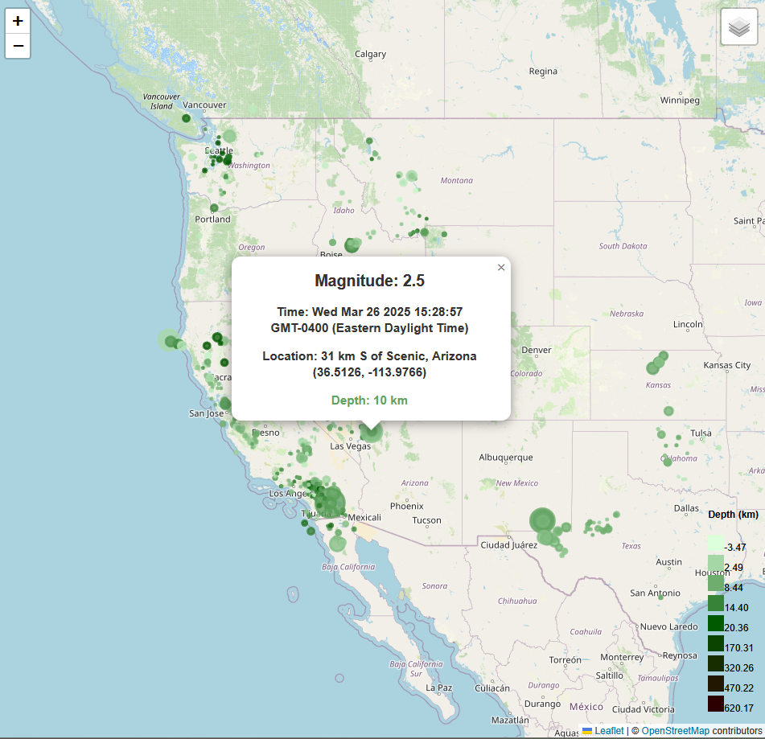
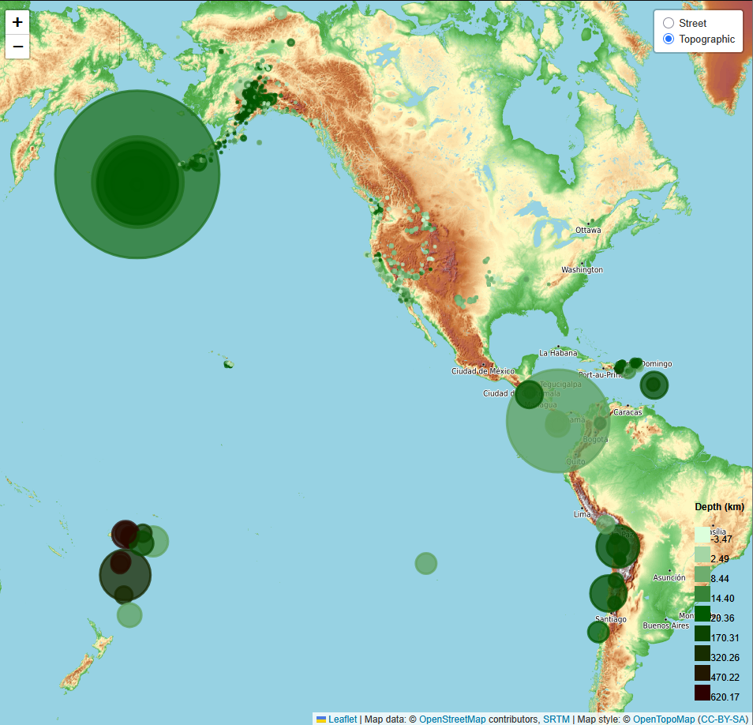

# Module 15: leaflet-challenge

## The Task
The United States Geological Survey, or USGS for short, is responsible for providing scientific data about natural hazards, the health of our ecosystems and environment, and the impacts of climate and land-use change. Their scientists develop new methods and tools to supply timely, relevant, and useful information about the Earth and its processes.

The USGS is interested in building a new set of tools that will allow them to visualize their earthquake data. They collect a massive amount of data from all over the world each day, but they lack a meaningful way of displaying it. In this challenge, I have been tasked with developing a way to visualize USGS data that will allow them to better educate the public and other government organizations (and hopefully secure more funding) on issues facing our planet.

## User Story
```md
AS A data analyst for the USGS
I WANT to visualize earthquake data
SO THAT we can better educate the public.
```

## Acceptance Criteria
```md
MAP
  * TileLayer loads without error
  * Connects to geojson API using D3 without error
  * Markers with size corresponding to earthquake magnitude
  * A legend showing the depth and their corresponding color

DATA POINTS
  * Data points scale with magnitude level
  * Data points colors change with depth level
  * Each point has a tooltip with the Magnitude, the location and depth
  * All data points load in the correct locations
```

## Example of Usage
Clicking on an earthquake circle will provide information about the location, magnitude, depth, and time:


In the top right, you can switch the visual layer to topographic:


## License
This project is licensed under the GNU General Public License v3.0.  
License Link:
https://www.gnu.org/licenses/gpl-3.0.en.html   
[](https://www.gnu.org/licenses/gpl-3.0)